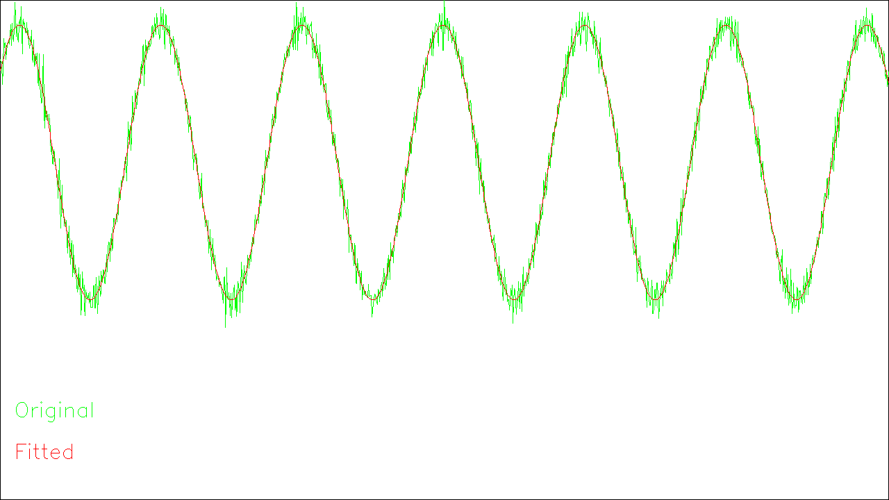
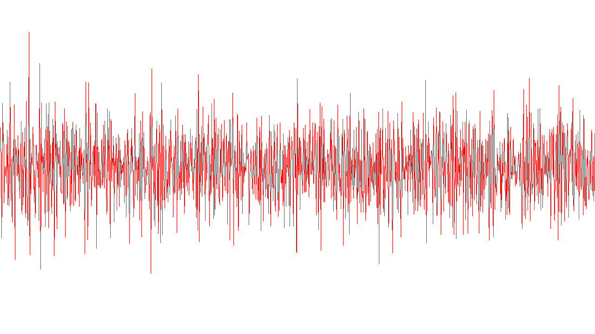

使用第二帧到倒数第二帧的数据估算参数  
有效样本数1438  
初始值取 $A = 0.5$, $b = 1.3$, $\Omega = 1.5$, $\varphi = 2$  
使用`DENSE_QR`求解器  
初始`cost = 110.5383` 结束`cost = 1.089241`

RMSE: 0.0389222 rad/s

### 观测点和拟合曲线

x轴单位: s, y轴单位: rad/s y轴[0,2]

### 残差图

x轴单位: s, y轴单位: rad/s y轴[-0.2,0.2]